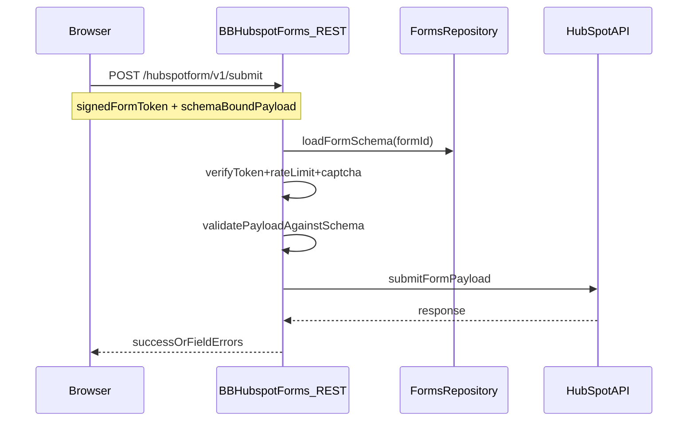

# 02 Architecture

## Overview

BB HubSpot Forms is a security-first WordPress plugin that stores form definitions as a custom post type (CPT) and renders them via shortcode or an optional block selector. Submissions are processed server-side through a REST controller that validates against the stored schema, enforces anti-spam controls, and forwards payloads to HubSpot using a dedicated client.

Key principles:
- Server-side schema validation is authoritative; client-provided field lists are never trusted.
- All submissions require a signed form token plus optional captcha validation.
- All HubSpot requests use SSL verification and strict error handling.

## Proposed Module Structure

### Settings
- Stores HubSpot credentials (portal ID, private app access token) and plugin-wide options.
- Stores captcha provider configuration and logging level.
- Stores dataLayer/payload defaults for analytics where required.

### Admin UI (CPT)
- Owns the form library list view and the schema editor UI.
- Provides list columns, filters, and bulk actions.

### Forms Repository (CPT)
- Owns CRUD and retrieval for `hubspot_form` posts and their meta schema.
- Provides schema accessors for renderer and REST validation.
- Provides versioning metadata to prevent stale submissions.

### Renderer
- Converts CPT schema into the frontend form markup and data attributes.
- Injects signed form token, schema version, and required submission metadata.
- Provides compatibility for both shortcode and block selector rendering.

### REST Controller
- Receives submissions, verifies the signed token, applies rate limiting,
  validates captcha, and validates the payload against the stored schema.
- Builds HubSpot submission payload and delegates to HubSpot Client.
- Returns normalized errors (field-specific and general) to the client.

### HubSpot Client
- Encapsulates API requests to HubSpot forms endpoints.
- Handles headers, timeouts, SSL verification, and response normalization.
- Enforces submission-only behavior (no CRM read operations in MVP).

### Security
- Generates and verifies form-signed tokens (HMAC + expiry + schema hash).
- Public submissions are protected by signed tokens; admin actions use nonces.
- Provides hardened input sanitization and strict validation rules.

### Spam
- Enforces business-email blocking and disposable domain list checks.
- Supports captcha provider verification (e.g., reCAPTCHA/Turnstile).
- Supports rate limiting and optional honeypot fields.

## Data Flow

### Render Flow
1. Admin creates a `hubspot_form` CPT record with schema and settings.
2. Shortcode or block selector requests a form by ID.
3. Renderer loads the CPT schema and generates HTML + data attributes.
4. Renderer injects a signed form token tied to schema version + expiry.
5. Frontend JS enhances UX only; it never defines authoritative validation.

### Submit Flow
1. Browser POSTs to `/hubspotform/v1/submit` with form token and payload.
2. REST Controller verifies the signed token and checks rate limits.
3. REST Controller verifies captcha (if enabled by schema or settings).
4. REST Controller validates payload against the stored schema.
5. REST Controller normalizes payload and submits to HubSpot.
6. Response is normalized into success or field errors for the client.

## Sequence Diagram

## Security Notes

- Signed token includes form ID, schema version, and expiry timestamp.
- Server validates required fields and types based on stored schema.
- Client-provided lists like `visible_fields` are ignored for validation.
- All outbound HubSpot requests use SSL verification and strict timeouts.

## Suggested Source Layout
- `src/Admin` (settings page, CPT editor UI)
- `src/Forms` (repository, schema, renderer)
- `src/REST` (controllers, routes, validators)
- `src/Security` (signer, rate limiter)
- `src/HubSpot` (client, payload mapping)
